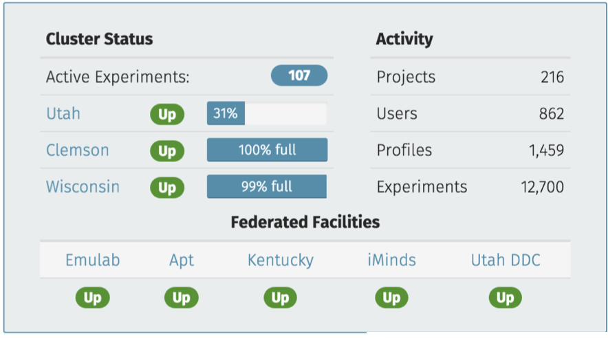
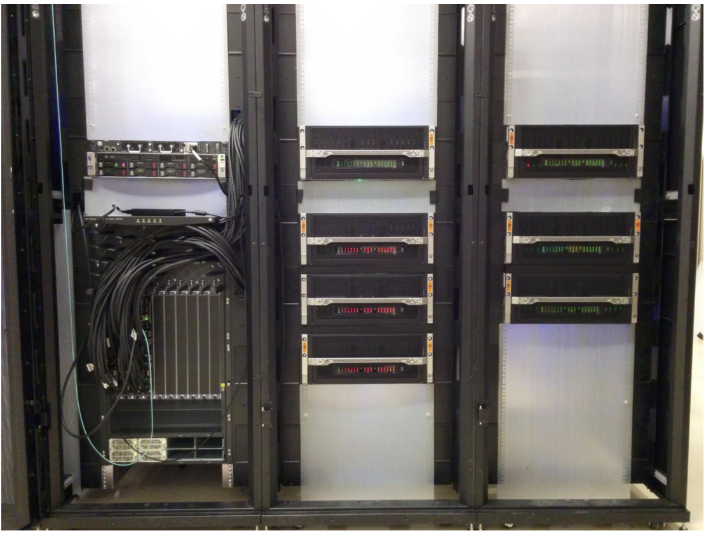
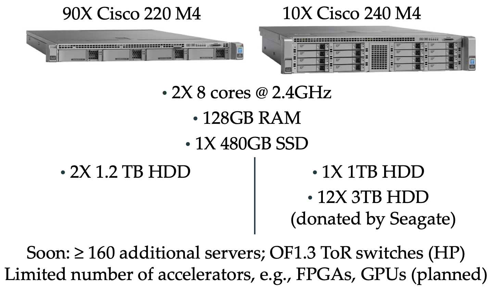
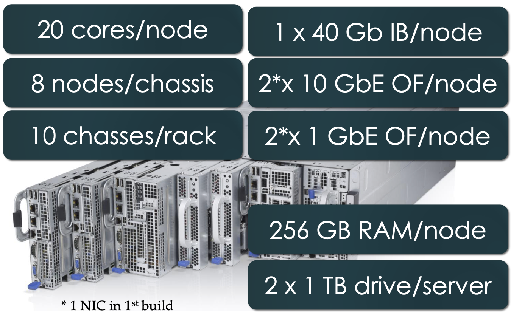
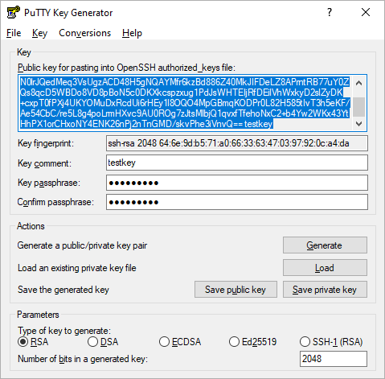
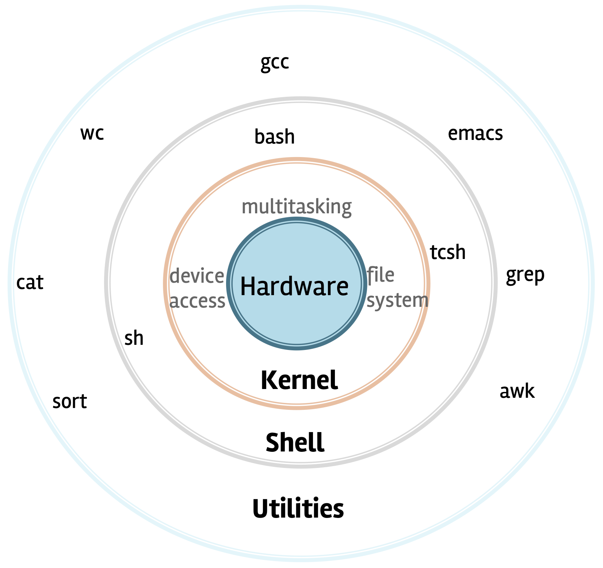
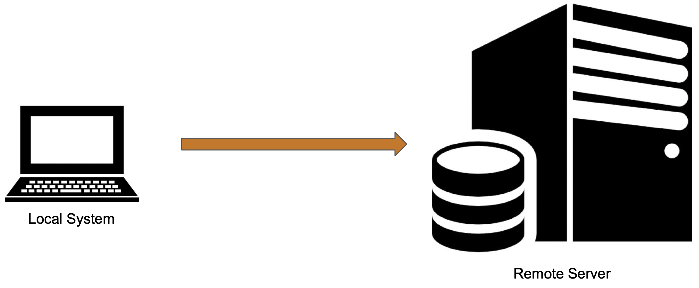
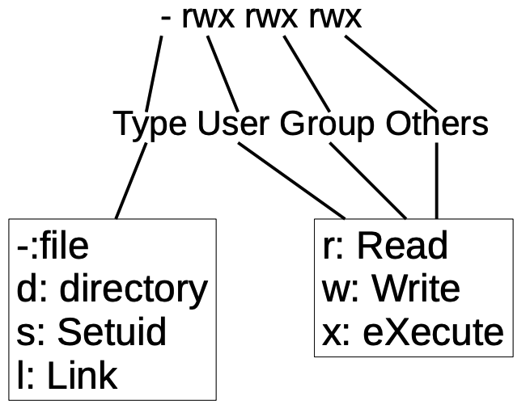

# What is CloudLab


<br /> 

- https://www.cloudlab.us/
- A shared cloud infrastructure for research and education in computer systems.
- The CloudLab clusters have almost 25,000 cores distributed across three sites around the United States.

---

# Crash course in CloudLab

- Underneath, it’s GENI
   - Same APIs, same account system
   - Even many of the same tools
   - Federated (accept each other’s accounts, hardware)
- Physical isolation for compute, storage (shared net.*)
- Profiles are one of the key abstractions
   - Defines an environment – hardware (RSpec) / software (images)
   - Each “instance” of a profile is a separate physical realization
   - Provide standard environments, and a way of sharing
   - Explicit role for domain experts
- “Instantiate” a profile to make an “Experiment”
   - Lives in a GENI slice

---

# CloudLab's hardware


For more information: https://docs.cloudlab.us/hardware.html

---

# Who Use Cloudlab?

- Course instructors and students
   - For doing lab assignments and final projects
- System researchers

---

# Cloudlab usage - on a typical day


---

# Cloudlab usage - on a busy day (SIGCOMM 2022 deadline)



---

# CloudLab users across the United States


---

# CloudLab users around the World


---

# CloudLab Hardware

---

# Utah/HP: Very dense



---

# Utah/HP: Low-power ARM64


---

# Utah - Suitable for experiments that:

- ... explore power/performance tradeoffs
- ... want instrumentation of power and temperature 
- ... want large numbers of nodes and cores
- ... want to experiment with RDMA via RoCE
- ... need bare-metal control over switches
- ... need OpenFlow 1.3
- ... want tight ARM64 platform integration

---

# Wisconsin/Cisco


---

# Wisconsin - Compute and storage



---

# Wisconsin - Suitable for experiments that

- ... need large number of nodes/cores, and bare-metal control over nodes/switches, for sophisticated network/memory/storage research
- ... study network I/O performance, intra-cloud routing (e.g., Conga) and transport (e.g., DCTCP)
- ... study network virtualization (e.g., CloudNaaS)
- ... study in-memory big data frameworks (e.g., Spark/SparkSQL/Tachyon)
- ... explore cloud-scale resource management and scheduling (e.g., Mesos; Tetris)
- ... explore new models for Cloud storage (e.g., tiered; flat storage; IOFlow)
- ... explore new architectures (e.g., RAM Cloud for storage)

---

# Clemson/Dell: High Memory, InfiniBand (IB)



---

# Clemson - Suitable for experiments that:

- need large per-core memory 
   - e.g., High-res media processing
   - e.g. Hadoop
   - e.g., Network Function Virtualization
- ... want to experiment with IB and/or GbE networks 
   - e.g., hybrid HPC with MPI and TCP/IP
- ... need bare-metal control over switches 
- ... need OpenFlow 1.3

--- 

# CloudLab Hands On

--- 

# Register Cloudlab Account

- https://www.cloudlab.us/signup.php


---

# Launch A Cloudlab Instance 

### “Start Experiment” (the most common)
- Decide your instance type and check its availability
https://www.cloudlab.us/resinfo.php
- Name your experiments with CloudLabLogin-ExperimentName
  - Naming scheme prevents conflicts caused when everyone picks random names 
- The default expiration time is 16 hours.
   - But extensions can be requested.
- Once expired, old data are discarded.
   - Backup data. Write a script to rebuild environment automatically.
   - Or create your own disk image (snapshot).

---

# Launch A Cloudlab Instance 

### “Reserve Nodes”
- For a longer machine time, e.g., one week.
- Most reservations need cloudlab administrator’s approval.

---

# Policies on using CloudLab resources

**Be a good Citizen!**

**Do not leave your CloudLab experiment instantiated unless you are using it!**

**Stick to your own resources and do not access another member's resources.**

---

# Demo

- Launch an instance
- Customize cloudlab profile
- Create disk image
- SSH example
- Use web serial console

---

# SSH

---

# What is SSH

- Secure Shell

- Communication Protocol (like http, https, ftp, etc)

- Do just about anything on the remote computer

- Traffic is encrypted

- Used mostly in the terminal/command line

---

# Clint/Server communication

- SSH is the client 

- SSHD is the server (Open SSH Daemon)

- The server must have sshd installed and running or you will not be able to connect using SSH

  - CloudLab machines are configured with sshd installed


---

# Authentication methods

```bash
$ ssh alice@amd198.utah.cloudlab.us
```

- Password
  - Password stored on server
  - User supplied password compared to stored version

- Public/Private key pair (recommended)
  - Private key kept on client
  - Public key stored on server 
---

# Generating keys

```bash
$ ssh-keygen -t rsa -b 4096
```
- Generated files
   - ~/.ssh/id_rsa   (private key)
   - ~/.ssh/id_rsa.pub (public key)

- Key can be used for multiple servers
   - Private key shall never leave your control
   - Public key goes into server authorized_keys file 

- For security, protect your private key using a hard-to-guess passphrase
   - Passphrase encrypts the private key
   - ssh-agent let us enter the passphrase once and remember the private key

---

# SSH agent

- Remembers your private key(s)

- Lets you enter the passphrase once and remember the private key

- Other applications can ask SSH agent to authenticate you automatically

---

# Working with SSH agents

- Start the SSH agent in the background

   ```bash
   $ eval `ssh-agent`
   ```

- Add the private key

   ```bash
   $ ssh-add ~/.ssh/id_rsa
   ```

- Forward the SSH agent (forwarding allows you to use your local SSH keys)

   ```bash
   $ ssh -A alice@amd198.utah.cloudlab.us
   ```

<!-- When ssh-agent starts up, it doesn’t have any keys in memory; the ssh-add command asks you for the passphrase for a given key, then hands the unlocked key to ssh-agent so it can later hand it out to future ssh sessions.

For reference, SSH supports agent forwarding, where you can ssh to Machine1, logging in with a key provided by your client’s ssh-agent, and ssh from Machine1 to Machine2, and have the ssh-agent request sent back to your original client’s ssh-agent as well.  This allows you to keep the private key only on the local machine, but jump from machine to machine without having to start fresh sessions directly from the client machine. -->

---

# What about Windows 

- Windows 10 now supports native SSH
- PuTTY is used in older versions of Windows
- Git Bash & other terminal programs include the ssh command & other Unix tools

---

# Generating keys: PuTTYgen

<div class="columns">
<div>

- Public key
   - Copy-paste the OpenSSH-compatible public key to a file

- Private key 
   - Click the 'Save private key' button
   - Give the private key file an extension of `.ppk`

</div>

<div class="center">



</div>
</div>

---

# Working with SSH agents: Pageant

<div class="columns">
<div>

- Open pageant
   - Pageant starts by default minimized in the system tray

- Click the 'Add Key' button to add the private key

- Check the 'Allow agent forwarding'
   - In PuTTy, under Connection / SSH / Auth

</div>

<div class="center">


</div>
</div>


---


# Add Public Key to CloudLab

<div class="columns">
<div class="center">


</div>

<div class="center">


</div>
</div>

<div class="columns">
<div class="center">
To a new account
</div>
<div class="center">
To an existing account 
</div>
</div>

<br>

- CloudLab configures server authorized_keys file with public key

---

# Linux

## What, Who, When, Where & Why
---

# What is Linux

- Unix-like computer operating system assembled under the model of free and open-source software development and distribution.
- These operating systems share the Linux kernel.
  - Typically have the GNU utilities
- Comes in several “distributions” to serve different purposes.

---
# What is Linux

<div class="columns">
<div>
<h3>Bird’s eye view</h3>
</div>

<div>



</div>

</div>

---
# Who is Linux

<div class="columns">
<div>


Linux is an O/S core originally written by Linus Torvalds. Now almost 10,000 developers including major technology companies like Intel and IBM.
</div>

<div>


A set of programs written by Richard Stallman and others. They are the GNU utilities.
</div>
</div>

---

# When is Linux?

<div class="img-overlay-wrap">
   <svg xmlns="http://www.w3.org/2000/svg" viewBox="0 0 350 100">
   <defs>
      <marker id="arrowhead" markerWidth="10" markerHeight="7" 
      refX="0" refY="3.5" orient="auto">
         <polygon points="0 0, 10 3.5, 0 7" />
      </marker>
   </defs>
   <text x="20" y="35" class="tiny">1991</text>
   <line x1="40" y1="45" x2="120" y2="75" stroke="#000" 
   stroke-width="2" marker-end="url(#arrowhead)" />
   </svg>
   
</div>

---
# Where is Linux
- World Wide Web
   - 67% of the world’s web-servers run Linux (2016)
- Research/High-Performance Compute
   - Google, Amazon, NSA, 100% of TOP500 Super-computers.
- Modern Smartphones and devices
   - The Android phone
   - Amazon Kindle
   - Smart TVs/Devices

---

# Why Linux

- Free and open-source.
- Powerful for research datacenters
- Personal for desktops and phones
- Universal
- Community (and business) driven.

---
# Connecting

## Let’s use Linux
 
---



---

# Connection Protocols and Software

<div class="columns-three">
<div>

<div class="small center">
Remote Connections: <br>Secure SHell <br>(SSH)
</div>


</div>

<div>

<div class="small center">
Remote Graphics: <br>X-Windowing <br>(X, X-Win)
</div>


</div>

<div>

<div class="small center">
Data Transfer: <br>Secure File Transfer Protocol <br>(SFTP)
</div>


</div>

</div>

---

# Connecting from Different Platforms

<table class="small">
   <thead>
      <tr>
         <th align="center"></th>
         <th align="center">SSH</th>
         <th align="center">X-Win</th>
         <th align="center">SFTP</th>
        </tr>
    </thead>
    <tbody>
        <tr>
            <td align="center" rowspan=3>Microsoft<br> Windows</td>
        </tr>
        <tr>
            <td align="center" colspan=3>MobaXterm<br> <a href="https://mobaxterm.mobatek.net">https://mobaxterm.mobatek.net</a></td>
        </tr>
        <tr>
            <td align="center" colspan=3>PuTTY<br> <a href="https://www.putty.org/">https://www.putty.org/</a></td>
        </tr>
        <tr>
            <td align="center">Apple<br> MacOS</td>
            <td align="center">Terminal<br> (Built in)</td>
            <td align="center">XQuartz<br><a href="https://www.xquartz.org">https://www.xquartz.org</a></td>
            <td align="center">Various<br>(Built in)</td>
        </tr>
        <tr>
            <td align="center">Linux</td>
            <td align="center">Terminal<br>(Built in)</td>
            <td align="center">X11<br>(Built in)</td>
            <td align="center">Various<br>(Built in)</td>
        </tr>
    </tbody>
</table>

---

# Microsoft Windows

You need software that emulates an “X” terminal and that connects using the “SSH” Secure Shell protocol.
- Recommended: PuTTY
   - Download: http://www.putty.org/
- Alternatives:
   - MobaXterm
      http://mobaxterm.mobatek.net/
   - SSH/X-Windows: X-Win32
      https://www.bu.edu/tech/services/support/desktop/distribution/xwindows/
   - SFTP: Filezilla
      https://filezilla-project.org/

---

# Apple macOS

- SSH: Terminal
   - Built in to macOS
     Applications > Utilities > Terminal
- X-Windows: XQuartz
   - Download: https://www.xquartz.org/
   - Note: This install requires a logout.
- SFTP: Your choice
   - Filezilla: https://filezilla-project.org/
   - Cyberduck: https://cyberduck.io
   - Many others

---
# Linux

- SSH: Terminal 
   - Built in to Linux
   Applications > System > Terminal
- X-Windows: X11
   - Built in to Linux
   - Use your package manager.
- SFTP: Your choice
   - Usually has one Built in.
   - Alternate: Filezilla (https://filezilla-project.org/)

---

# Connecting

- Use your CloudLab account

---

# Linux Interaction
## Shell, Prompt, Commands and System Use
 
---

# Linux: The Shell


- Program that *interprets commands* and sends them to the OS
- Provides:
   - Built-in commands
   - Programming control structures
   - Environment variables
- Linux supports multiple shells.
   - The default on CloudLab is Bash
      “Bash” = “Bourne-again Shell”
      (GNU version of ~1977 shell written by Stephen Bourne)

---

# Linux: The “prompt”


<br>
<center> ( In Linux “ ~ ” is a shorthand for your home directory. ) </center>

---

# Linux: Command Basics


- <span style="color:blue">Command: Command/program that does one thing</span>

- <span style="color:green">Options: Change the way a command does that one thing</span>
   - Short form: Single-dash and one letter e.g. ls -a
   - Long form: Double-dash and a word e.g. ls --all

- <span style="color:orange">Argument: Provides the input/output that the command interacts with.</span>

<br>
<center>For more information about any command, use <b>man</b> or <b>info</b> (e.g. “<b>man ls</b>”)</center>

---
#  Commands: Hands-On

After you connect, type

```bash
whoami                           # my login
hostname                         # name of this computer
echo “Hello, world”              # print characters to screen
echo $HOME                       # print environment variable
echo my login is $(whoami)       # replace $(xx) with program output 
date                             # print current time/date
cal                              # print this month’s calendar
shazam                           # bad command
``` 

---

# Commands: Hands-On Options

- Commands have three parts; command, options and arguments/parameters.

- Example: cal –j 3 1999

   ```
   [username@scc1 ~]$ cal -j 3 1999
   ```

   -  `cal` is the command, 
   -  `-j` is an option (or switch)
   -  `3` and `1999` are arguments/parameters.

- What is the nature of the prompt?
- What was the system’s response to the command?

---

# Commands

## "Small programs that do one thing well"

- The Unix Programming Environment, Kernighan and Pike

   ... at its heart is the idea that the power of a system comes more from the <span style="color:green">relationships</span> among programs than from the programs themselves. Many UNIX programs do quite trivial things in isolation, but, combined with other programs, become general and useful tools.
 
---

# Commands: Selected text processing utilities

<div class="footnotesize">
<div class="columns">            
<div> 

|command|description
|:------|:----------
| `wc`  |Line, word and character count
| `awk` | Pattern scanning and processing language
| `cat` | Display file(s)
| `cut` | Extract selected fields of each line of a file
| `diff`| Compare two files
| `grep`| Search text for a pattern
| `head`| Display the first part of files
| `less`| Display files on a page-by-page basis

</div>

<div>

|command|description
|:------|:----------
| `sed` | Stream editor (esp. search and replace)
| `sort` |Sort text files
| `split`|Split files
| `tail` |Display the last part of a file
| `tr`   |Translate/delete characters
| `uniq` |Filter out repeated lines in a file
| `wc`   |Line, word and character count

</div>

---

# Variables and Environment Variables

- *Variables* are named storage locations. 
   - `USER=augustin`
   - `foo="this is foo’s value"`

- *Environment variables* are variables used and shared by the shell
   - For example, `$PATH` tells the system where to find commands.

- Environment variables are **shared with programs** that the shell runs.
 
 ---

# Bash variables

- To create a new variable, use the assignment operator `=` 

   ```
   [username@scc1 ~]$ foo="this is foo’s value"
   ```

- The foo variable can be printed with `echo`
 
   ```
   [username@scc1 ~]$ echo $foo this is foo’s value
   ```

- To make `$foo` visible to programs run by the shell (i.e., make it an “environment variable”), use `export`:

   ```
   [username@scc1 ~]$ export foo
   ```

---

# Environment Variables

To see all currently defined environment variable, use printenv:
 
```  
[username@scc1 ~]$ printenv
HOSTNAME=scc1
TERM=xterm-256color
SHELL=/bin/bash
HISTSIZE=1000
TMPDIR=/scratch
SSH_CLIENT=168.122.9.131 37606 22
SSH_TTY=/dev/pts/191
USER=cjahnke
MAIL=/var/spool/mail/cjahnke 
PATH=/usr3/bustaff/cjahnke/apps/bin:/usr/local/bin:/bin:/usr/bin:/usr/local/sbin:/usr/sbin:/sbin PWD=/usr3/bustaff/cjahnke/linux-materials
LANG=C
MODULEPATH=/share/module/bioinformatics:/share/module/chemistry
SGE_ROOT=/usr/local/ogs-ge2011.11.p1/sge_root
HOME=/usr3/bustaff/cjahnke
```

---

# Command History and Command Line Editing

- Try the `history` command
- Choose from the command history using the up ↑ and down ↓ arrows
- To redo your last command, try `!!`
- To go further back in the command history try `!`, then the number as shown by history (e.g., `!132`). Or, `!ls`, for example, to match the most recent `ls` command.
- What do the left ← and right → arrow do on the command line?
- Try the <b>\<Del></b> and <b>\<Backspace></b> keys

---

#  Help with Commands


- Type
   - `date –-help`
   - `man date`
   - `info date`
- BASH built-ins
   - A little different from other commands
   - Just type the command `help`
   - Or `man bash`
 
---

# On using man with less

The `man` command outputs to a pager called `less`, which supports many ways of scrolling through text:

```bash
Space, f    # page forward
b           # page backward
<           # go to first line of file
>           # go to last line of file
/           # search forward (n to repeat)
?           # search backward (N to repeat)
h           # display help
q           # quit help
```

---

# I/O Redirection

---

# I/O redirection with pipes

- Many Linux commands print to “standard output”, which defaults to the terminal screen. The `|` (pipe) character can be used to divert or “redirect” output to another program or filter.

   ```bash
   w                    # show who's logged on

   w | less             # pipe into the 'less' pager
   w | grep 'tuta'      # pipe into grep, print lines containing 'tuta' 
   w | grep -v 'tuta'   # print only lines not containing ‘tuta’

   w | grep 'tuta' | sed s/tuta/scholar/g
                        # replace all 'tuta' with 'scholar'
   ```

---

# More examples of I/O redirection

- Try the following (use up arrow to avoid retyping each line):

   ```bash 
   w | wc                              # count lines
   w | cut –d ' ' –f1 | sort           # sort users
   w | cut –d ' ' –f1 | sort | uniq    # eliminate duplicates
   ```
- We can also redirect output into a file:
   ```bash
   w | cut –d ' ' –f1 | sort | uniq > users
   ```
- Note that 'awk' can be used instead of 'cut':
   ```bash
   w | awk '{print $1;}' | sort | uniq > users
   ```
- Quiz:
   - How might we count the number of distinct users currently logged in? 
   For extra credit, how can we avoid over-counting by 2? (Hint: use `tail`.)

---

# The Filesystem

- The Linux File System
- The structure resembles an upside-down tree
- Directories (a.k.a. folders) are collections of files and other directories.
- Every directory has a parent except for the root directory.
- Many directories have subdirectories.

 

---


---

# Navigating the File System

Essential navigation commands:
```bash
pwd   # print current directory
ls    # list files
cd    # change directory
```

---

# Navigating the File System

We use *pathnames* to refer to files and directories in the Linux file system.

- There are two types of pathnames:
   - *Absolute* – The full path to a directory or file; begins with `/`
   - *Relative* – A partial path that is relative to the current working directory;
   does not begin with `/`

---

# Navigating the File System

Special characters interpreted by the shell for filename expansion:

```bash
~        # your home directory (e.g., /usr1/tutorial/tuta1) 
.        # current directory
..       # parent directory
*        # wildcard matching any filename
?        # wildcard matching any character
TAB      # try to complete (partially typed) filename
```

---

# Navigating the File System

Examples:

```bash
cd /usr/local           # Change directory to /usr/local/lib
cd ~                    # Change to home directory (could just type 'cd')
pwd                     # Print working (current) directory
cd ..                   # Change directory to the “parent” directory 
cd /                    # Change directory to the “root”
ls –d pro*              # Listing of only the directories starting with 'pro'
```

---

# The ls Command

Useful options for the “ls” command:

```bash
ls -a       # List all files, including hidden files beginning with a '.' 
ls -ld *    # List details about a directory and not its contents
ls -F       # Put an indicator character at the end of each name 
ls –l       # Simple long listing
ls –lR      # Recursive long listing
ls –lh      # Give human readable file sizes
ls –lS      # Sort files by file size
ls –lt      # Sort files by modification time (very useful!)
```

---

# Some Useful File Commands

```bash
cp [file1] [file2]         # copy file
mkdir [name]               # make directory
rmdir [name]               # remove (empty) directory
mv [file] [destination]    # move/rename file
rm [file]                  # remove (-r for recursive)
file [file]                # identify file type
less [file]                # page through file
head -n N [file]           # display first N lines
tail -n N [file]           # display last N lines
ln –s [file] [new]         # create symbolic link
cat [file] [file2...]      # display file(s)
tac [file] [file2...]      # display file in reverse order 
touch [file]               # update modification time
od [file]                  # display file contents, esp. binary
```

---

# Manipulating files and directories

Examples:

```bash 
cd                                     # The same ascd ~
mkdir test
cd test
echo 'Hello everyone' > myfile.txt
echo 'Goodbye all' >> myfile.txt
less myfile.txt
mkdir subdir1/subdir2                  # Fails. Why?
mkdir -p subdir1/subdir2               # Succeeds
mv myfile.txt subdir1/subdir2
cd ..
rmdir test                             # Fails. Why?
rm –rf test                            # Succeeds
```

---

# Symbolic links

- Sometimes it is helpful to be able to access a file from multiple locations within the hierarchy. On a Windows system, we might create a "shortcut". On a Linux system, we can create a symbolic link:

   ```bash
   mkdir foo         # make foo directory
   touch foo/bar     # create empty file
   ln –s foo/bar .   # create link in current dir
   ```

---

# Finding a needle in a haystack

- The `find` command has a rather unfriendly syntax, but can be exceedingly helpful for locating files in heavily nested directories.
- Examples:
   ```bash
   find ~ -name bu –type d    # search for 'bu' directories in ~
   find . –name my-file.txt   # search for my-file.txt in .
   find ~ -name '*.txt'       # search for '*.txt' in ~
   ```

- Quiz:
   - Can you use find to locate a file called `needle` in your haystack directory?
   - Extra credit: what are the contents of the `needle` file?


---

# Processes & Job Control

---

# Processes and Job Control
- As we interact with Linux, we create numbered instances of running programs called *processes*. You can use the `ps` command to see a listing of your processes (and others!). To see a long listing, for example, of all processes on the system try:

   ```bash
   [username@scc1 ~]$ ps -ef
   ```

- To see all the processes owned by you and other members of the class, try:

   ```
   [username@scc1 ~]$ ps -ef | grep tuta
   ```

---
# File permissions

- Every file has a set of permissions, an owner user, and an owning group

- Permission format



---

# Viewing/changing permissions

- View permissions:

   ```bash
   ls -l
   ```

- Change permissions with chmod:

   ```bash
   chmod {ugo}{+-}{rwx} file
   ```
   
   Example:
   
   ```bash
   chmod o+rx myfile
   ```

- Change owner with chown:

   ```bash
   chown <user>:<group> <file>
   ```
---

# Processes and Job control

Use `top` to see active processes.

```bash
Tasks: 408 total,   1 running, 407 sleeping,   0 stopped,   0 zombie
Cpu(s):  0.3%us,  0.1%sy,  0.0%ni, 99.6%id,  0.0%wa,  0.0%hi,  0.0%si,  0.0%st
Mem:  99022756k total, 69709936k used, 29312820k free,   525544k buffers
Swap:  8388604k total,        0k used,  8388604k free, 65896792k cached

  PID USER      PR  NI  VIRT  RES  SHR S %CPU %MEM    TIME+  COMMAND
 7019 root      20   0  329m 137m 4852 S  4.0  0.1 217:01.56 sge_qmaster
38246 isw       20   0 88724 2764 1656 S  0.7  0.0   0:01.28 sshd
41113 cjahnke   20   0 13672 1512  948 R  0.7  0.0   0:00.03 top
 2324 root      20   0     0    0    0 S  0.3  0.0   0:21.82 kondemand/2
 7107 nobody    20   0 89572  10m 2400 S  0.3  0.0   2:18.05 gmond
27409 theavey   20   0 26652 1380  880 S  0.3  0.0   0:34.84 tmux
    1 root      20   0 25680 1604 1280 S  0.0  0.0   0:05.74 init
    2 root      20   0     0    0    0 S  0.0  0.0   0:00.07 kthreadd
    3 root      RT   0     0    0    0 S  0.0  0.0   0:00.89 migration/0
    4 root      20   0     0    0    0 S  0.0  0.0   0:01.72 ksoftirqd/0
    5 root      RT   0     0    0    0 S  0.0  0.0   0:00.00 stopper/0
```

---

# Foreground/background

- Thus far, we have run commands at the prompt and waited for them to complete. We call this running in the *foreground*.
- Use the `&` operator, to run programs in the *background*,
   - Prompt returns immediately without waiting for the command to complete:

   ```bash
   [username@scc1 ~]$ mycommand & 
   [1] 54356                                  # ← process id
   [username@scc1 ~]$
   ``` 

--- 

# Process Control Practice

- Let’s look at the `countdown` script, in your scripts folder for practice
 
   ```bash 
   [username@scc1 ~]$ cd ~/scripts 
   [username@scc1 ~]$ cat countdown
   ```

- Make the script executable with `chmod`:

   ```bash
   [username@scc1 ~]$ chmod +x countdown
   ```

- First, run it for a few seconds, then kill with Control-C.

   ```bash
   [username@scc1 ~]$ ./countdown 100 100
   99
   98
   ^C             # ← Ctrl-C = (^C)
   ``` 

---

# Process control

- Now, let’s try running it in the background with &:
   
   ```bash 
   [username@scc1 ~]$ ./countdown 60 & 
   [1] 54355
   [username@scc1 ~]$
   60
   59
   ```

- The program’s output is distracting, so redirect it to a file:

   ```bash
   [username@scc1 ~]$ countdown 60 > c.txt &
   [1] 54356
   [username@scc1 ~]$
   ```

---

#  Process control

- Type `ps` to see your countdown process.

- Also, try running `jobs` to see any jobs running in the background from this bash shell.

- To kill the job, use the `kill` command, either with the five-digit process id:

   ```bash
   kill 54356
   ```

- Or, you can use the job number (use `jobs` to see list) with `%`:

   ```bash
   kill %1
   ```
 
---

# Backgrounding a running job with C-z and `bg`

Sometimes you start a program, then decide to run it in the background.

```bash 
[username@scc1 scripts]$ ./countdown 200 > c.out
^Z                                                    # ← Ctrl-Z = (^Z)
[1]+  Stopped            ./countdown 200 > c.out

[username@scc1 scripts]$ bg 
[1]+ ./countdown 200 > c.out &

[username@scc1 scripts]$ jobs
[1]+ Running ./countdown 200 > c.out &

[username@scc1 scripts]$
```

---

# Editors

---

# Regular expressions

Many Linux tools, such as `grep` and `sed`, use strings that describe sequences of characters. These strings are called regular expressions.

Here are some examples:

```bash
^foo                 # line begins with “foo”
bar$                 # line ends with “bar”
[0-9]\{3\}           # 3-digit number
.*a.*e.*i.*o.*u.*    # words with vowels in order*
```

---

# File Editors

- nano
   - Lightweight editor

- emacs
   - Swiss-army knife, has modes for all major languages, and can be customized
   - Formerly steep learning curve has been reduced with introduction of menu and tool bars

- vim
   - A better version of vi (an early full-screen editor).
   - Very fast, efficient 
   - Steep learning curve 
   - Popular among systems programmers
   
---

# vi/vim

- vi/vim is a very popular text editor among programmers and system administrators
- It supports many programming and scripting languages
- Suitable for more advanced file editing
- vi/vim has two modes:
   1. *Text mode*: which can be enabled by typing <b>i</b> (insert) or <b>a</b> (append)
   1. *Command mode*: which will be enabled by pressing the <b>Esc</b> key on keyboard

---

# vi/vim: some useful commands

<div class="small">
<div class="columns">            
<div> 

|command|description
|:------|:----------
| `!`  | Forces the action
| `:q` | Quit
| `:q!` | Force quit
| `:w` | Write
| `:wq`| Write and quit
| `:x`|  Write (if have changes) and quit

</div>

<div>

|command|description
|:------|:----------
| `i` | Insert
| `a` | Append
| `x`| Delete a character
| `y[count]y` | Yank (copy) [count] lines
| `d[count]d`   | Cut (Delete) [count] lines
| `p`   | Paste after the current line

</div>

---

# Basic Bash Scripting in Linux

---

# What is Bash Script?

- Bash script is an executable file contains Bash shell commands which could
be used to automate and simplify things.

- Shell script is a text file starts with (`#!`) followed by the path to the shell
interpreter (i.e. `/bin/bash`)

---

# A simple bash script

```bash
#!/bin/bash

echo "Hello, World!"
```
---

# Running the bash script

```bash
$ ./hello.sh
bash: ./hello.sh: Permission denied

$ ls -l
-rw-r--r-- 1 alice alice 47 Nov 8 15:53 hello.sh

$ chmod u+x hello.sh

$ ls -l
-rwxr--r-- 1 alice alice 47 Nov 8 15:53 hello.sh

$ ./hello.sh
Hello, World!
```

---

# For loops

```bash
#!/bin/bash
for i in 1 2 3 4 5 6 7 8 9 10; do
   echo Count: ${i}
done
```

### Alternative approach using `seq`

```bash
for i in `seq 1 10`; do
   echo Count: ${i}
done
```

- Back ticks ( ` ) tell bash to execute the command in the ticks
- `seq 1 10` gives a list from 1 to 10

---

# `*`  wildcard in for loop

Perform some operation on every file in the directory:

```bash
for file in *.pdf; do
   pdftohtml ${file}
done
```
- `pdftohtml` is a command that converts a pdf file to html

---

# Control flow

```bash
#!/bin/bash

a=1
b=2

if [[ $a -gt $b ]]
then
    echo $a is greater than $b
elif [[ $a -lt $b ]]
then
    echo $a is less than $b
elif [[ $a -eq $b ]]
then
    echo $a is equal to $b
else
    echo "unknown condition"
fi
```

---

# Git and GitHub

---

# Demystifying Git and GitHub

*Git* is the software that allows us to do version control

- Git tracks changes to your source code so that you don’t lose any history of your project

*Github* is an online platform where developers host their source code (and can share it the world)

- You can host remote repositories on https://github.com/
- You edit and work on your content in your local repository on your computer, and then you send your changes to the remote

---

# Why you should use Git

To be kind to yourself

To be kind to your collaborators

To ensure your work is reproducible

## Spillover benefits

👩‍🔬 📐 It imposes a certain discipline to your programming.

🤓 🔥 You can be braver when you code: if your new feature breaks, you can revert back to a version that worked!

---

# Workflow


---
# Workflow

- Clone the repo

   ```bash
   git clone https://github.com/walice/git-tutorial.git
   ```

- Work on `penguins.R`

- Stage your files

   ```bash
   git add .
   ```

- Commit your changes

   ```bash
   git commit -m "Add example code"
   ```

- Push your changes

   ```bash
   git push
   ```

---

# More command line tips

---

# Tell Git who you are

As a first-time set up, you need to tell Git who you are.

```bash
git config --global user.name "Your name"
git config --global user.email "alice@example.com"
```

---

# git status

Use this to check at what stage of the workflow you are at

- You have made some local modifications, but haven't staged your changes yet

```bash
git status
```

```bash
Changes not staged for commit:
  (use "git add <file>..." to update what will be committed)
  (use "git checkout -- <file>..." to discard changes in working directory)
         modified:   penguins.R
no changes added to commit (use "git add" and/or "git commit -a")
```

---

# git pull

Use this to fetch changes from the remote and to merge them in to your local repository

- Your collaborators have been adding some awesome content to the repository, and you want to fetch their changes from the remote and update your local repository

```bash
git pull
```

- What this is doing under-the-hood is running a git fetch and then git merge.


---

# Adding and ignoring files

To stage specific files in your repository, you can name them directly

```bash
git add penguins.R other-script.R
```

or you can add all of them at once

```bash
git add .
```

You might want to not track certain files in your local repository, e.g., sensitive files such as credentials. But it might get tedious to type out each file that you do want to include by name.

Use a `.gitignore` file to specify files to always ignore.

Create a file called `.gitignore` and place it in your repo. The content of the file should include the names of the files that you want Git to not track.

---

# git log

Use this to look at the history of your repository.

Each commit has a specific hash that identifies it.

git log
commit af58f79bfa4301643025dd6c8767e65349cf407a
Author: Name <Email address>
Date:   DD-MM-YYYY
    Add penguin script
You can also find this on GitHub, by going to github.com/user-name/repo-name/commits.

You can go back in time to a specific commit, if you know its reference.

---

# Undoing mistakes

Imagine you did some work, committed the changes, and pushed them to the remote repo. But you'd like to undo those changes.

Running git revert is a "soft undo".

Say you added some plain text by mistake to penguins.R. Running git revert will do the opposite of what you just did (i.e., remove the plain text) and create a new commit. You can then git push this to the remote.

```bash
git revert <hash-of-the-commit-you-want-to-undo>
git push
```

---
# Undoing mistakes

git revert is the safest option to use.

It will preserve the history of your commits.

```bash
git log
commit 6634a076212fb7bac16f9525feae1e83e0f200ca
Author: Name <Email address>
Date:   DD-MM-YYYY
     Revert "Add plain text to code by mistake"
     This reverts commit a8cf7c2592273ef6a28920222a92847794275868.
commit a8cf7c2592273ef6a28920222a92847794275868
Author: Name <Email address>
Date:   DD-MM-YYYY
    Add plain text to code by mistake
```