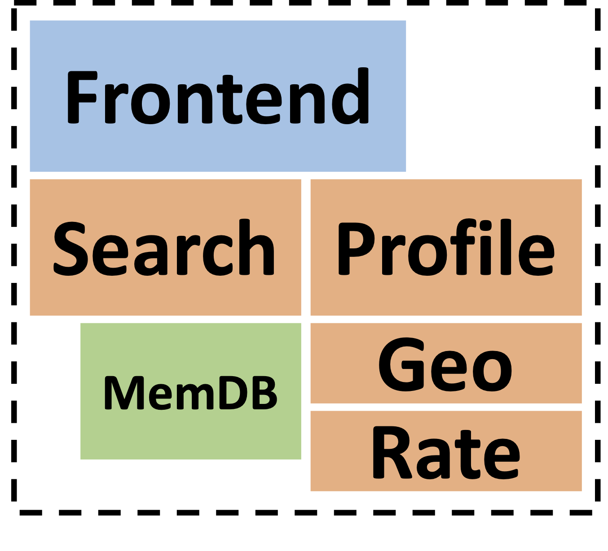
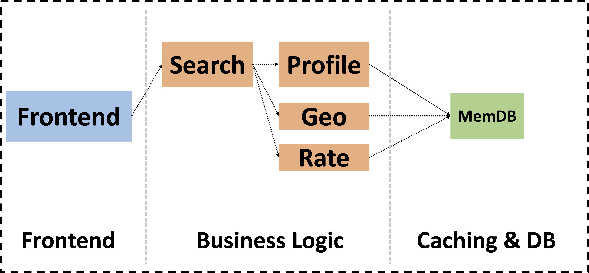
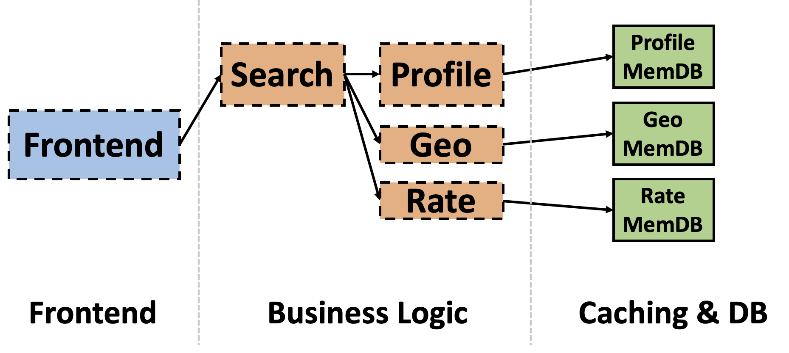
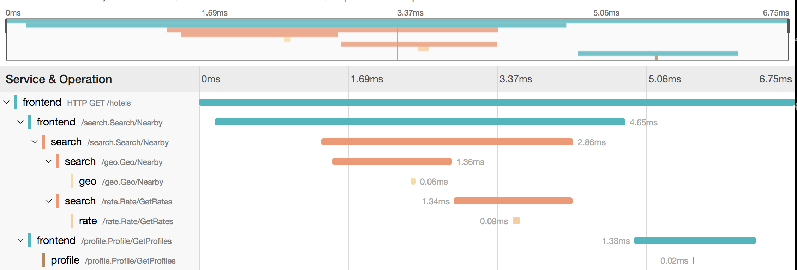

# Start a CloudLab experiment

- Go to your CloudLab dashboard
- Click on the Experiments tab
- Select Start Experiment
- Click on Change Profile
  - Select `multi-node-cluster` profile in the `UCY-CS499-DC` project
- Name your experiments with CloudLabLogin-ExperimentName
  - Prevents everyone from picking random names 

---

# Hotel Map

<div class="columns">

<div>

- Core functionality
  - Plots hotel locations on a Google map
&nbsp;

- Lab work  
  - You have implemented a monolith
  - **Today you will decompose the monolith into microservices**
  
</div>

<div>


</div>

</div>

---

# Monolithic architecture

<div class="columns">

<div>

### All the app components are tightly coupled into a single binary (monolith)

Components
- `frontend` exposes an HTTP server to serve the website
- `search` finds nearby hotels available during given time periods
- `geo` provides all hotels within a given distance
- `profile` returns the profile for a given hotel
- `rate` returns rates for hotels available during given time periods
</div>

<div>



<div class="small center">Hotel Map monolith </div>



<div class="small center">Components organized into three logical tiers </div>
<div class="small center">(dotted arrow lines show local function calls) </div>

</div>

</div>

---

# Microservices architecture

<div class="columns">

<div>

### Each app component runs as a separate microservice

Microservices
- `frontend` exposes an HTTP server to serve the website
- `search` finds nearby hotels available during given time periods
- `geo` provides all hotels within a given distance
- `profile` returns the profile for a given hotel
- `rate` returns rates for hotels available during given time periods
</div>

<div>



<div class="small center">Microservices organized into three logical tiers</div>
<div class="small center">(solid arrow lines show remote communication) </div>

</div>

</div>

---

# Cloning the repository

- Clone the repository on `node0`:

  ```bash
  $ git clone git@github.com:ucy-coast/hotel-app.git
  $ cd hotel-app
  ```

- Checkout the branch containing the multi-container version:

  ```
  $ git branch TBD
  ```

---

# Docker Compose: Multi Container Applications

<div class="columns">

<div>

Docker

- Build and run one container at a time
- Manually connect containers together
- Must be careful with dependencies and start  up order


</div>

<div>

Docker Compose
- Define multi container app in `docker-compose.yml` file
- Single command to deploy entire app
- Handles container dependencies
<!-- - Works with Docker Swarm, Networking, Volumes, Universal Control Plane -->


</div>

</div>

---

# Hotel Map docker-compose.yml

<div class="columns">

<div>

```yaml
version: "3"
services:
  frontend:
    build: .
    image: hotel_app_frontend_single_node_memdb
    entrypoint: frontend
    container_name: 'hotel_app_frontend'
    ports:
      - "8080:8080"
    restart: always

  profile:
    build: .
    image: hotel_app_profile_single_node_memdb
    entrypoint: profile
    container_name: 'hotel_app_profile'
    ports:
      - "8081:8081"
    restart: always

  search:
    build: .
    image: hotel_app_search_single_node_memdb
    entrypoint: search
    container_name: 'hotel_app_search'
    ports:
      - "8082:8082"
    restart: always

  geo:
    build: .
    image: hotel_app_geo_single_node_memdb
    container_name: 'hotel_app_geo'
    entrypoint: geo
    ports:
      - "8083:8083"
    restart: always

  rate:
    build: .
    image: hotel_app_rate_single_node_memdb
    container_name: 'hotel_app_rate'
    entrypoint: rate
    ports:
      - "8084:8084"
    restart: always

  jaeger:
      image: jaegertracing/all-in-one:latest
      container_name: 'hotel_app_jaeger'
      ports:
        - "14269"
        - "5778:5778"
        - "14268:14268"
        - "14267"
        - "16686:16686"
        - "5775:5775/udp"
        - "6831:6831/udp"
        - "6832:6832/udp"
      restart: always
```

</div>

<div>

- Defines 5+1 services to run as containers

  - `frontend`
  - `profile` 
  - `search`
  - `geo`
  - `rate`
  &nbsp;
  - `jaeger`  (more on this later)
</div>

</div>

---

# Implementing the `profile` service

You will

- Define the gRPC service
- Generate client and server stubs
- Write code to create the server 

---

# `profile` source code

- `cmd/profile`: contains the main microservice code

- `internal/profile`: contains the private library code

---

# Defining the gRPC service

In a `.proto` file, you will

- Specify a named service 
- Specify request and response data types
- Define rpc methods

---

# Defining the `profile` service 

Add the following to `internal/profile/proto/profile.proto`:

```proto
service Profile {
  rpc GetProfiles(Request) returns (Result);
}
```

---

# Defining request and response data types

Add the following to `internal/profile/proto/profile.proto`:

<div class="columns">

<div>

```proto
message Request {
  repeated string hotelIds = 1;
  string locale = 2;
}

message Result {
  repeated Hotel hotels = 1;
}

message Hotel {
  string id = 1;
  string name = 2;
  string phoneNumber = 3;
  string description = 4;
  Address address = 5;
  repeated Image images = 6;
}
```

</div>

<div>

```proto
message Address {
  string streetNumber = 1;
  string streetName = 2;
  string city = 3;
  string state = 4;
  string country = 5;
  string postalCode = 6;
  float lat = 7;
  float lon = 8;
}

message Image {
  string url = 1;
  bool default = 2;
}
```

</div>

</div>


---

# Generating client and server stubs

Run the following from the `internal/profile/proto` directory:

```bash
$ protoc --go_out=plugins=grpc:. profile.proto
```

Generates the `profile.pb.go` file

- Contains the protocol buffer code to populate, serialize, and retrieve request and response message types

---

# Creating the `profile` server 

- Implement the service interface generated from our service definition

- Run a gRPC server to listen for requests from clients and dispatch them to the right service implementation

---

# Implementing the service interface

Add the following to `internal/profile/profile.go`

```go
func (s *Profile) GetProfiles(ctx context.Context, req *pb.Request) (*pb.Result, error) {
	res := new(pb.Result)
	hotels := make([]*pb.Hotel, 0)

	for _, id := range hotelIds {
		hotels = append(hotels, db.getProfile(id))
	}
	
	res.Hotels = hotels

	return res, nil
}
```

---

# Running the gRPC server 

Add the following to `internal/profile/profile.go`

<div class="columns">

<div>

```go
func (s *Profile) Run() error {
	if s.port == 0 {
		return fmt.Errorf("server port must be set")
	}

	opts := []grpc.ServerOption{
		grpc.KeepaliveParams(keepalive.ServerParameters{
			Timeout: 120 * time.Second,
		}),
		grpc.KeepaliveEnforcementPolicy(keepalive.EnforcementPolicy{
			PermitWithoutStream: true,
		}),
		grpc.UnaryInterceptor(
			otgrpc.OpenTracingServerInterceptor(s.tracer),
		),
	}

	// Create an instance of the gRPC server
	srv := grpc.NewServer(opts...)

	// Register our service implementation with the gRPC server
	pb.RegisterProfileServer(srv, s)

	// Listen for client requests
	lis, err := net.Listen("tcp", fmt.Sprintf(":%d", s.port))
	if err != nil {
		log.Fatalf("failed to listen: %v", err)
	}

	// Accept and serve incoming client requests 
	log.Printf("Start Profile server. Addr: %s:%d\n", s.addr, s.port)
	return srv.Serve(lis)
}
```

</div>

<div>

- Creates an instance of the gRPC server
- Registers our service implementation with the gRPC server
- Specifies the port we want to use to listen for client requests using:
- Accept and serve incoming client requests 

</div>

</div>

---

# Creating the client

You will 

- Create a client stub to perform RPCs
- Use the client to call service methods

--- 

# Creating a client stub

Add the following to `internal/frontend/frontend.go`

```go
func (s *Frontend) initProfileClient() error {
	conn, err := dialer.Dial(s.profileAddr, s.tracer)
	if err != nil {
		return fmt.Errorf("did not connect to profile service: %v", err)
	}
	s.profileClient = profile.NewProfileClient(conn)
	return nil
}
```

- Creates a gRPC channel to communicate with the server
- Creates a client stub to perform RPCs

---

# Calling service methods

Add the following to `internal/frontend/frontend.go`

```go
// hotel profiles
profileResp, err := s.profileClient.GetProfiles(ctx, &profile.Request{
  HotelIds: searchResp.HotelIds,
  Locale:   locale,
})
if err != nil {
  http.Error(w, err.Error(), http.StatusInternalServerError)
  return
}
```

- Calls the `GetProfiles` RPC using the client stub
  - This is almost as straightforward as calling a local method

---

# Deploying Hotel Map with Docker Compose

---

# Defining the `profile` container

<div class="columns">

<div>

```
  profile:
    build: .
    image: hotel_app_profile_single_node_memdb
    entrypoint: profile
    container_name: 'hotel_app_profile'
    ports:
      - "8081:8081"
```

</div>

<div>

- `build`: Specifies the directory containing the Dockerfile 
- `image`: Specifies the image to start the container from. Names the built image with the specified name.
- `entrypoint`: Sets the command and parameters that will be executed first when a container runs
- `container_name`: Sets the actual name of the container when it runs
- `ports`: exposes specified container ports

</div>

</div>

---

# Running Hotel Map

Run our app:

```
$ docker-compose up
```

Build and recreate all containers:

```
$ docker-compose up --build --force-recreate
```

```
Creating hotel_app_search ... 
Creating hotel_app_profile ... 
...
Attaching to hotel_app_search, hotel_app_rate, hotel_app_geo, hotel_app_profile, hotel_app_frontend, hotel_app_jaeger
hotel_app_search | 2022/08/04 08:48:54 Connect to geo:8083
hotel_app_search | 2022/08/04 08:48:54 Connect to rate:8084
hotel_app_rate | 2022/08/04 08:48:55 Start Rate server. Addr: 0.0.0.0:8084
hotel_app_search | 2022/08/04 08:48:54 Start Search server. Addr: 0.0.0.0:8082
...
hotel_app_frontend | time="2022-08-04T08:49:50Z" level=info msg="searchHandler [lat: 37.7749, lon: -122.4194, inDate: 2015-04-09, outDate: 2015-04-10]"
...
```

---

# Visiting Hotel Map

```
http://c220g1-030621.wisc.cloudlab.us:8888
```

<span style="font-size: 24px">Note: `c220g1-030621.wisc.cloudlab` is the public URL of `node0`</span>


---

# Tracing gRPC requests between services with Jaeger

```
http://c220g1-030621.wisc.cloudlab.us:16686/search
```

<span style="font-size: 24px">Note: `c220g1-030621.wisc.cloudlab` is the public URL of `node0`</span>


